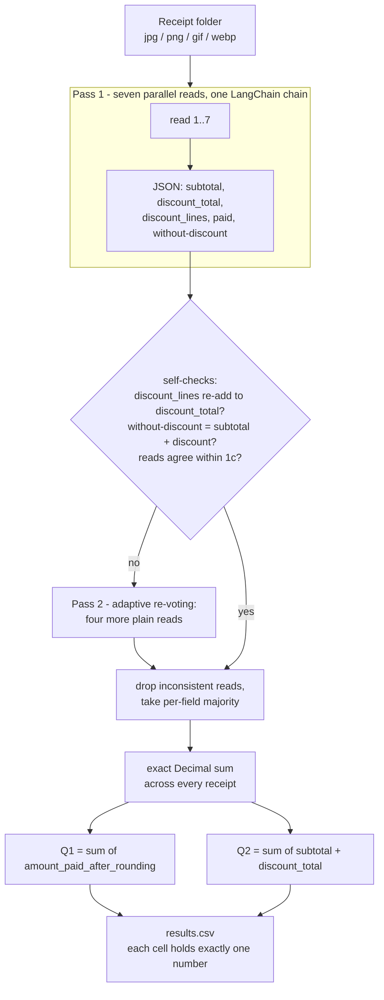

# FTEC5660 Homework 1: Receipt Chain

Build a LangChain pipeline that reads every supermarket receipt in a folder
with the vision-capable DeepSeek Flash model and answers these two questions:

1. How much money did I spend in total for these bills?
2. How much would I have had to pay without the discount?

For this homework, **amount spent** means the final payment after the receipt's
rounding line. **Without the discount** means the sum of the original positive
item prices: add back every promotion, coupon, member, app, packaging-damage,
and percentage discount, but do not add back rounding.

## Student task

Only edit the two functions in `hw1.py` that contain `### YOUR CODE HERE`:

- `build_chain()` creates your LangChain chain.
- `answer_queries()` runs the chain on the receipt images and returns one final
  response for each question.

You may use prompt chaining, routing, parallel calls, reflection, or a
combination. Your final responses should each contain one HKD amount. Do not
hard-code filenames or public answers; grading uses unseen receipt folders.

## Setup and public test

```bash
python3 -m venv .venv
source .venv/bin/activate
pip install -r requirements.txt
```

Put your DeepSeek key after `DEEPSEEK_API_KEY=` in `.env`, then run:

```bash
python3 hw1.py --image-folder public_test
```

The program creates `results.csv` in the current directory. Its columns are
`query`, `model_response`, and `correctness`. The public answers are in
`public_test/ground_truth.json`. The starter intentionally returns the dummy
response `please design your chain to answer these two queries.` so it runs
before you add any API code.

The required model is `deepseek-v4-flash-vision-exp`, the vision-capable
DeepSeek Flash model. JPEG, PNG, GIF, and WebP inputs are accepted by the
homework runner.


## Homework 1 solution:

### Chain design



### How it works

The whole solution lives in the two marked functions of `hw1.py`.
`build_chain()` wires up one LCEL chain - a `RunnableLambda` that turns a
receipt path into a multimodal `HumanMessage` (the extraction prompt plus the
image as a base64 data URL), then `ChatDeepSeek` with
`deepseek-v4-flash-vision-exp`, then a `StrOutputParser` - so the model and the
prompt are created exactly once.

`answer_queries()` never trusts the model with arithmetic. It asks the chain
for **seven independent structured reads** of every receipt, each returning a
strict JSON object with four numeric fields plus a list:
`amount_paid_after_rounding` (the payment line right after `ROUNDING`, used for
Q1), `subtotal_after_discounts_before_rounding` (the `小計` line),
`discount_total` (every promotion, coupon, member, app and packaging-damage
line added back as a positive number - explicitly excluding `ROUNDING`, change
and payment lines), `amount_without_discounts`, and `discount_lines` (every
discount line listed with its printed label and its printed amount, so the
total can be re-added and the label cannot be confused with the amount column).
Because LangChain's `batch` runs those reads concurrently, the extra votes cost
wall-clock time, not accuracy.

Two guards sit between the model and the total. First a **self-consistency
check**: the listed `discount_lines` must re-add to `discount_total`, and
`amount_without_discounts` must equal `subtotal + discount_total`. Any read
that breaks either identity has certainly mis-read a line and is dropped before
voting. Second, **adaptive re-voting**: a receipt whose reads disagree by more
than one cent, whose payment differs from its subtotal by more than a plausible
rounding amount, or which produced an inconsistent read, gets four more plain
reads. Seven votes were chosen because a wrong majority always shows up as
disagreement, so it always triggers the extra round, and eleven votes are far
harder to sway than five.

Surviving votes are combined per field by **majority rather than by median**.
Reading a receipt is a transcription task with discrete answers, so if two
reads say 76.71 and one says 100.21 the truth is 76.71 - whereas a median can
average two different readings into an amount that never appeared on the paper.
The median is kept only as a tie-break. The agreed per-receipt figures then
feed an exact `Decimal` summation on the host, which is what actually answers
the two questions.

This design keeps the LLM doing only what it is good at (reading a photographed
receipt) and pushes all counting, rounding and addition into deterministic
Python code, so a single mis-read digit cannot silently shift the total. Each
final response is formatted as a single `HK$` amount, satisfying the "exactly
one number per response" rule.

### Measured behaviour

On the seven `public_test` receipts both queries score `correct`
(`HK$1974.30` and `HK$2348.20`) and every per-receipt figure matches
`ground_truth.json`. Repeated runs and re-combined subsets of the public
receipts were used to check stability, since grading uses three independent
runs over an unseen folder.

